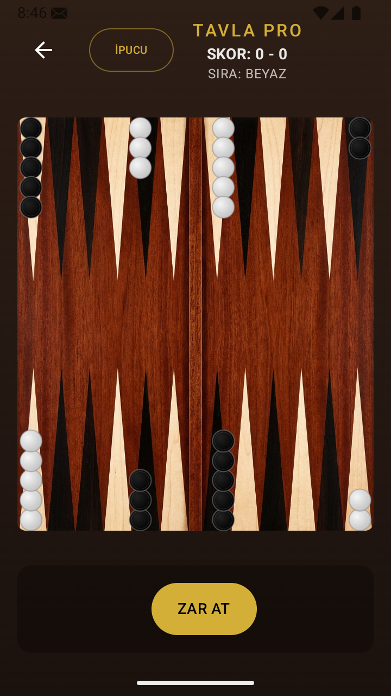
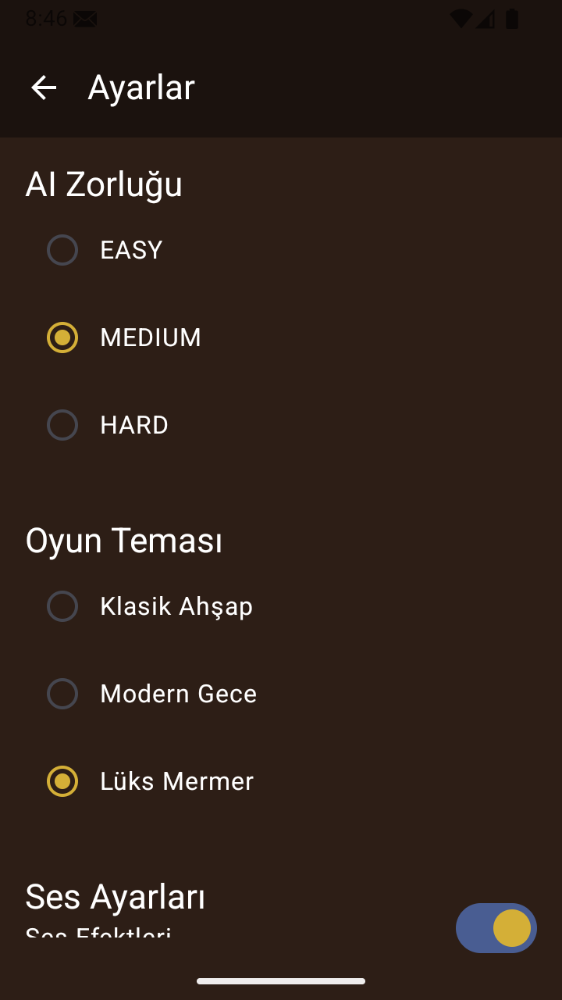

# Tavla Pro - Ultimate Experience 🎲

Tavla Pro, modern tasarımı, akıllı yapay zekası ve pürüzsüz animasyonlarıyla üst düzey bir tavla deneyimi sunan profesyonel bir Android uygulamasıdır. Jetpack Compose kullanılarak geliştirilmiş, performans odaklı ve kullanıcı dostu bir yapıya sahiptir.

## 📸 Ekran Görüntüleri

<p align="center">
  
  
  
</p>

## ✨ Öne Çıkan Özellikler

- **🎨 Dinamik Tema Sistemi**: Klasik Ahşap, Modern Gece ve Lüks Mermer seçenekleriyle oyunu kişiselleştirin.
- **🤖 Gelişmiş Yapay Zeka (AI)**: Farklı zorluk seviyelerinde AI'ya karşı oynayın. Sıkıştığınızda **İPUCU** butonunu kullanarak AI'dan hamle tavsiyesi alın.
- **🔄 Akıllı Animasyonlar**: Taşların tahta üzerinde pürüzsüzce kaymasını sağlayan gerçekçi animasyon motoru.
- **🎲 Profesyonel Zar Sistemi**: Rastgelelik garantili ve görsel olarak anime edilmiş zar atma deneyimi.
- **⏪ Geri Al (Undo)**: Yapılan hamleleri sıra bitmeden geri alabilme imkanı.
- **🔊 Ses Motoru**: Zar, taş vuruşu ve galibiyet için özel ses efektleri (Ses altyapısı hazır, dosyalar eklenebilir).
- **📊 Maç Skoru & Geçmiş**: Room database entegrasyonu ile maç skorlarını takip edin ve geçmiş oyunlarınızı görün.

## 🛠️ Teknik Altyapı

- **Dil**: Kotlin
- **UI Framework**: Jetpack Compose
- **Mimari**: MVVM (Model-View-ViewModel)
- **Veritabanı**: Room Persistence Library
- **Navigasyon**: Jetpack Navigation
- **Asenkron**: Kotlin Coroutines & Flow
- **Bağımlılık Yönetimi**: Hilt / ViewModel Factory

## 🚀 Kurulum

1. Bu depoyu klonlayın:
   ```bash
   git clone https://github.com/ekayazilim/TavlaPro.git
   ```
2. Android Studio'yu açın ve projeyi içe aktarın.
3. Gerekli SDK bileşenlerinin yüklü olduğundan emin olun.
4. `Build -> Rebuild Project` yaparak projeyi derleyin ve çalıştırın.

## 📄 Lisans

Bu proje MIT Lisansı ile lisanslanmıştır. Daha fazla bilgi için `LICENSE` dosyasına bakabilirsiniz.

---
*Geliştiren: Eka Yazılım Bilişim Sistemi*
